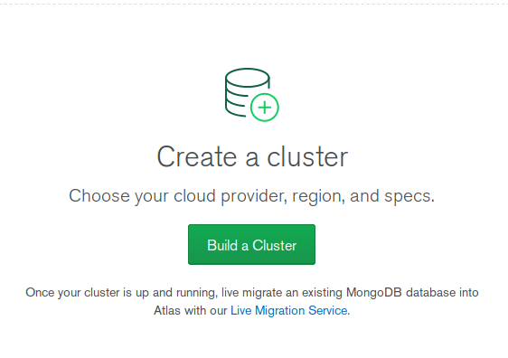
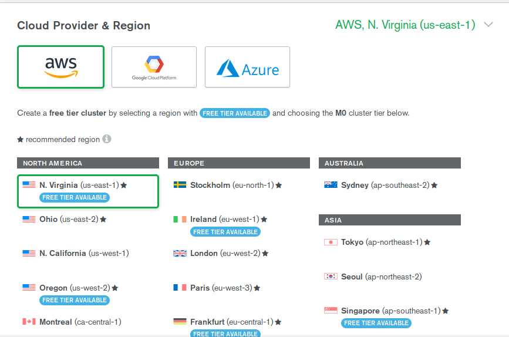
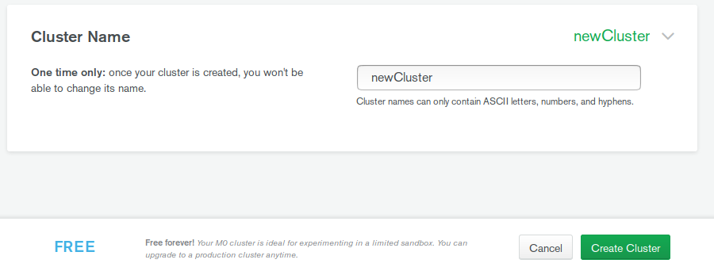
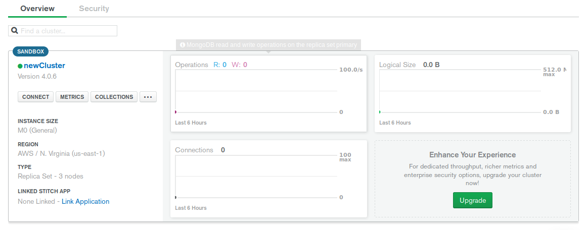
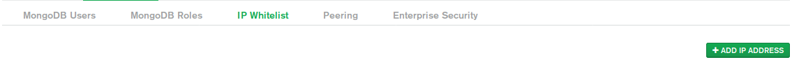
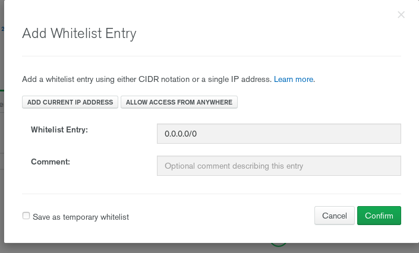
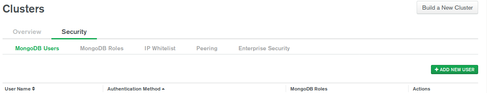
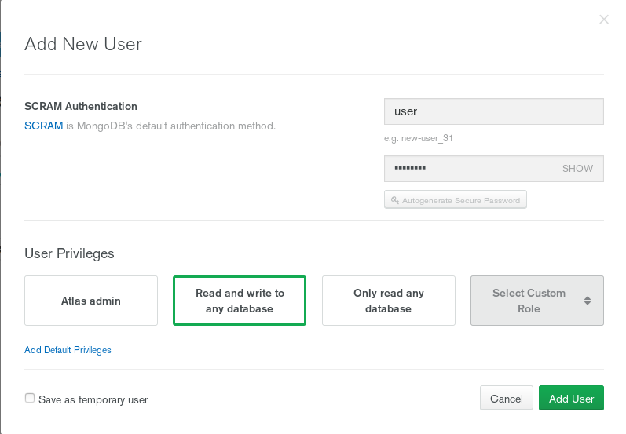
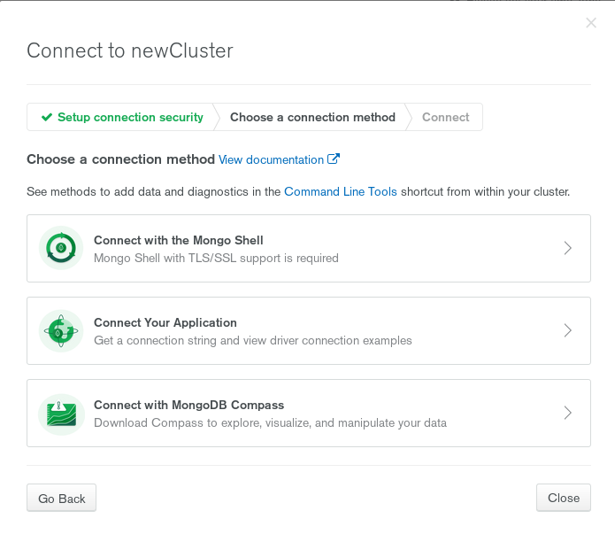
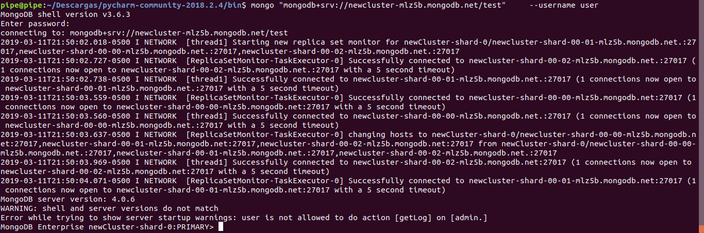

# MongoDB Basics

### Create a cluster

1. Create a user in mongoDB Atlas:

    https://www.mongodb.com/cloud/atlas
    
    configure connection 
    https://docs.atlas.mongodb.com/mongo-shell-connection/
    
    go to C:\Program Files\MongoDB\Server\4.0\bin

2. Build a new cluster:

   1. Sign in and build a new cluster

   

   2. Select a provider and location

   

   3. Name and created the cluster

      

   4. Wait while the cluster is created

      

   5. Add a Whitelist to connect

      

      

   6. Add users to the cluster

      

      

   7. Select your connection mode

      

   8. Go to your Terminal and connect

      

      


### Basic CRUD syntax

1. Create a new Database

   ```javascript
   show dbs
   use databaseName
   show collections
   ```

2. Insert some data

   ```javascript
   db.teams.insertOne({name:"Atletico Nacional"}); 
   db.teams.insertOne({name:"Millonarios",city:"Bogota"});
   db.teams.insertOne({_id:"1cdP",name:"America",city:"Cali"});
   db.teams.insertMany([{name:"Cali",city:"Cali"},{name:"Santa fe",city:"Bogota"}]);
   ```

3. Basic queries

   ```javascript
   db.teams.findOne({name:"Millonarios"});
   db.teams.find({}).pretty();
   db.teams.find({},{name:1,_id:0});
   ```

4. Update fields

   ```javascript
   db.teams.updateOne({name:"Atletico Nacional"},{$set:{city:"Medellin"}});
   db.teams.updateMany({city:"Cali"},{$set:{stadium:"Pascual guerrero"}});
   ```

5. Delete fields

   ```javascript
   db.teams.deleteOne({city:"Bogota"});
   db.teams.deleteMany({city:"Barranquilla"});
   db.teams.drop();
   ```

### Upload Data

1. We leave the cluster and locate where is  a loadMovieDetailsDataset.js file. Next we reconnect a load a Script.

   ```javascript
   load("loadMovieDetailsDataset.js");
   ```

2. We're going to movie database and query for how many movies has Drama in their genres

   ```javascript
   db.movieDetails.find({"genres":{$in:["Drama"]}}).count()
   ```

3. Query the titles of the movies that won two awards.

   ```javascript
   db.movieDetails.find({"awards.wins":2},{"title":1}).pretty()
   ```

### Activity 

For more information go to  https://docs.mongodb.com/manual/tutorial/query-documents/ 

1. Update all movies where rated is R and runtime is greater than 100 minutes.
2. How Many movies hasn't a image tomato attribute?
3. Check out all the movies where Juliann Margulies has participated and last more than 100 minutes.
4. Check only the genres of the movies than has more than 3 awards nomination.
5. How many movies has exactly 3 genres?
6. Which movies were released in 2002 or 2010?
7. Which movies have a different duration that 95 minutes?
8. How long are the movies where they have participated Adam Sandler or Natalie Portman?
9. What movies was released after 1990?
10. Delete all movies that was released between 1980 and 1990.  
